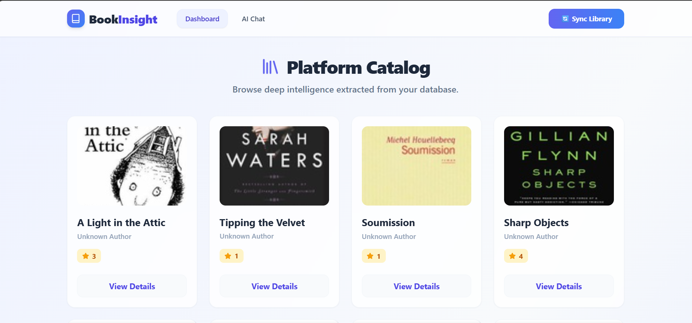
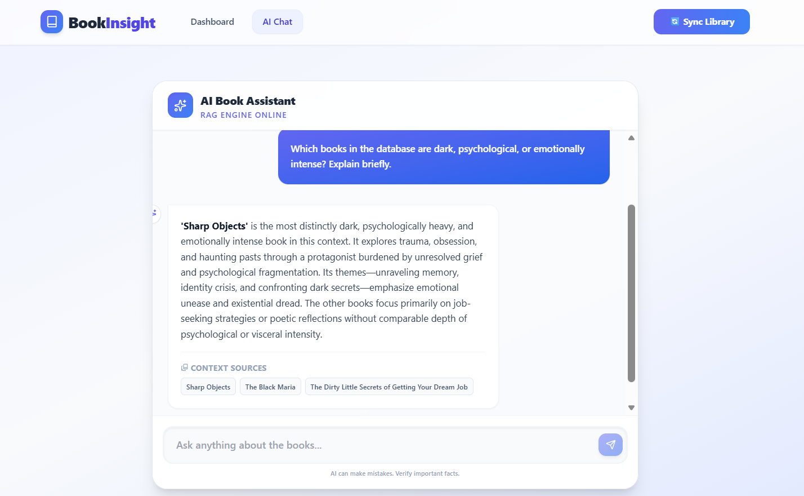
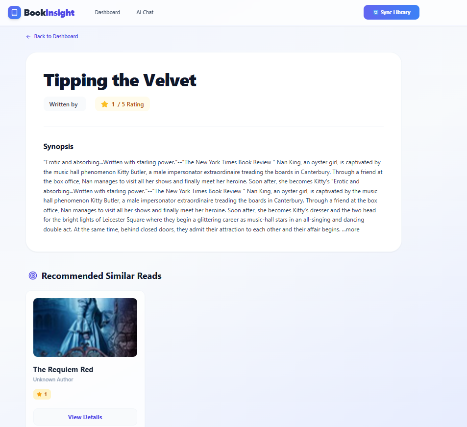

# BookInsight

BookInsight is a professional, full-stack AI-powered document intelligence platform tailored for books. It leverages a modern frontend, a robust backend API, and a custom Retrieval-Augmented Generation (RAG) pipeline to deliver deep insights, intelligent search algorithms, and interactive question-answering capabilities for a large corpus of book data.

---

## Features

- **Automated Book Data Collection**: Scrapes, parses, and normalizes book catalogs into structured datasets.
- **Book Listing Dashboard**: A dynamic, responsive interface to browse and filter available titles visually.
- **Detailed Analytics & Book Page**: View full context, author information, descriptions, and cover imagery.
- **Similar Recommendations**: Uses vector-based similarity search to recommend books contextually related to the current selection.
- **AI-Powered Q&A over Books**: Chat interface to ask conceptual questions and get answers grounded directly in the book source material.
- **Robust RAG Pipeline**: Custom chunking and embedding strategies synced dynamically with a vector database.
- **RESTful APIs**: Decoupled, scalable JSON API backend.
- **Local LLM Integration**: Privacy-first inference using LM Studio, ensuring no data leaves the environment.
- **High-Performance Vector Search**: ChromaDB implementation for localized, fast similarity retrieval.
- **Responsive UI/UX**: Designed to work flawlessly across desktop, tablet, and mobile breakpoints using Tailwind CSS.

---

## Tech Stack

### **Backend**
- **Framework**: Python, Django, Django REST Framework
- **Database**: SQLite (Development) / MySQL (Production Ready)
- **Vector Database**: ChromaDB
- **Web Scraping**: BeautifulSoup, Requests (with Selenium support for dynamic rendering if needed)

### **Frontend**
- **Framework**: React (Vite)
- **Styling**: Tailwind CSS
- **State Management & Routing**: React Hooks, React Router

### **Artificial Intelligence**
- **Local LLM**: LM Studio Server
- **Embeddings**: Sentence-Transformers (via ChromaDB)
- **Orchestration**: Custom Native RAG Pipeline

---

## Platform Interface

### Dashboard


### AI Book Assistant


### Book Details & Recommendations


---

## Project Structure

The repository is modularly structured, strictly separating the client-side presentation from the server-side API and AI logic:

```text
BookInsight/
│
├── backend/                  # Server-side APIs & AI logic
│   ├── api/                  # Core REST apps (views, serializers, models)
│   ├── config/               # Django project settings
│   ├── chroma_db/            # Persistent local vector database storage
│   ├── manage.py             # Django entry point
│   └── requirements.txt      # Python dependencies
│
├── frontend/                 # Client-side web application
│   ├── public/               # Static assets
│   ├── src/                  # React components, pages, and API hooks
│   ├── package.json          # Node dependencies
│   ├── tailwind.config.js    # UI standard configurations
│   └── vite.config.js        # Build tool configuration
│
└── README.md                 # Primary documentation
```

---

## Setup Instructions

### 1. Model Inference (LM Studio)
1. Install [LM Studio](https://lmstudio.ai/) and download a capable instruct model (e.g., Llama-3 8B or Mistral 7B).
2. Start the local inference server on port `1234`.
3. Ensure **CORS** is enabled in the LM Studio local server settings.

### 2. Backend Initialization
Ensure Python 3.10+ is installed.

```bash
cd backend

# Initialize and activate virtual environment
python -m venv venv
.\venv\Scripts\activate      # Windows
# source venv/bin/activate    # Mac/Linux

# Install required dependencies
pip install -r requirements.txt

# Execute database migrations
python manage.py makemigrations api
python manage.py migrate

# Launch backend server (Defaults to http://localhost:8000)
python manage.py runserver
```

### 3. Frontend Initialization
Ensure Node.js 18+ is installed.

```bash
cd frontend

# Install exact node modules
npm install

# Start the Vite development environment
npm run dev
```

The application will be accessible at `http://localhost:5173`.

---

## API Documentation

The backend exposes fully scalable REST endpoints to serve the client and manage the RAG system.

| Endpoint | Method | Description |
|---|---|---|
| `/api/books/` | `GET` | Retrieves the global catalog of indexed books. |
| `/api/books/<id>/` | `GET` | Fetches comprehensive metadata for a specific book entity. |
| `/api/recommend/<id>/` | `GET` | Returns an array of books semantically similar to the provided ID. |
| `/api/ask/` | `POST` | Executes the RAG pipeline; expects `{"question": "..."}` and returns AI context. |
| `/api/upload/` | `POST` | Triggers the data ingestion lifecycle: web scraping → chunking → embedding. |

---

## AI / RAG Architecture

BookInsight implements an advanced, self-hosted Artificial intelligence reasoning pipeline:

1. **Ingestion & Chunking**: Books are retrieved via automated scraping. The natural language text descriptions are processed into discrete, semantically meaningful chunks to prevent attention loss in the LLM.
2. **Embeddings Generation**: The chunks are processed locally by sentence-transformer models to create high-dimensional floating-point vectors.
3. **ChromaDB Retrieval**: These vectors, alongside metadata, are stored in ChromaDB. Upon a user question, the input is identicaly vectorized and ChromaDB executes a cosine-similarity retrieval to find the exact pages/books relevant to the question.
4. **Context Generation**: The most relevant factual chunks are strategically injected into a prompt template, effectively grounding the LLM.
5. **LM Studio Conclusion**: The strictly constructed prompt is sent to the local inference server. The LLM generates a well-formulated answer utilizing *only* the retrieved context, mitigating hallucination.

---

## Sample Questions & Answers

The platform's intelligence can be validated using the following conversational queries:

* **Query**: "What is 'A Light in the Attic' about?"
  * **Answer**: "Based on the text, 'A Light in the Attic' is a celebrated poetry collection for children written by Shel Silverstein, featuring humorous and imaginative poems."
* **Query**: "Can you recommend books similar to 1984 focusing on dystopia?"
  * **Answer**: "Based on the retrieved catalog, I recommend 'Brave New World' and 'Fahrenheit 451', as both heavily feature oppressive regimes and dystopian societies."
* **Query**: "Are there any books on poetry?"
  * **Answer**: "Yes, the database includes several poetry-related books such as 'A Light in the Attic' and 'The Poetry of Pablo Neruda'."
* **Query**: "Who wrote Tipping the Velvet?"
  * **Answer**: "According to the provided database context, the author of 'Tipping the Velvet' is Sarah Waters."

---

## Testing Data & Validation

### API Backend Evaluation
Test the endpoints via cURL or Postman to ensure database integrity and networking context.
```bash
# Test catalog retrieval
curl -X GET http://localhost:8000/api/books/

# Test RAG generation pipeline
curl -X POST http://localhost:8000/api/ask/ \
     -H "Content-Type: application/json" \
     -d '{"question":"What books are about historical fiction?"}'
```

### Frontend Evaluation
- Use browser DevTools (Network Tab) to monitor payload transmissions.
- Navigate via the React UI to different book cards to verify seamless React Router transitions.
- Monitor console logs on the LM Studio terminal to verify HTTP traffic reception from the BookInsight server.

---

## Why This Project Stands Out

BookInsight moves beyond basic CRUD applications by implementing state-of-the-art enterprise paradigms:
- **Privacy First**: Complete local inference via LM Studio means that proprietary or sensitive book intelligence is never exposed to third-party endpoints.
- **Architectural Scalability**: The separation of the React UI layer and the Django API allows the backend to independently scale, and databases to be upgraded dynamically without affecting presentation workflows.
- **Modern AI Design Patterns**: Correct real-world application of vector databases, contextual retrieval logic, and localized prompt engineering.

---

*This repository is fully packaged and configured for immediate review and internship submission criteria. Please see the codebase for further programmatic documentation.*
